# Hi 👋, I'm Muhammad Reza Aditya Ramadhan

### Full Stack Developer · Backend Enthusiast · Product Builder

  Building modern web & mobile applications, 
  scalable backend systems, and digital products that solve real problems.

  📍 Depok, Indonesia 🇮🇩

  

---

## 👨‍💻 About Me

- 🌱 Currently learning **Golang, Vite & Express.js**
- 💻 Focused on **Full Stack Development, Backend Engineering & Mobile Development**
- 🚀 Interested in building **scalable applications, APIs, and digital products**
- 🧠 Exploring **software architecture, backend systems, and modern development practices**
- 📫 Reach me at **[rezaadityaa26@gmail.com](mailto:rezaadityaa26@gmail.com)**
- ⚡ Fun fact: **I like building things that make money 💸**

---

## 🚀 Languages & Frameworks

 

---

## 🗄️ Database & Backend Tools

 

---

## 🎨 Design & Development Tools

 

---

## 📊 GitHub Statistics

<picture>
  <source
    media="(prefers-color-scheme: dark)"
    srcset="assets/github-profile/overview.dark.svg"
  />
  <source
    media="(prefers-color-scheme: light)"
    srcset="assets/github-profile/overview.light.svg"
  />
  
</picture>

 

---

## 📈 Contribution Activity

<picture>
  <source
    media="(prefers-color-scheme: dark)"
    srcset="assets/github-profile/contributions.dark.svg"
  />
  <source
    media="(prefers-color-scheme: light)"
    srcset="assets/github-profile/contributions.light.svg"
  />
  
</picture>

 

---

## 🗓️ Contribution History

<picture>
  <source
    media="(prefers-color-scheme: dark)"
    srcset="assets/github-profile/lifetime.dark.svg"
  />
  <source
    media="(prefers-color-scheme: light)"
    srcset="assets/github-profile/lifetime.light.svg"
  />
  
</picture>

 

---

## 🤝 Let's Connect

 

---

### ✨ Thanks for visiting my profile!

  

